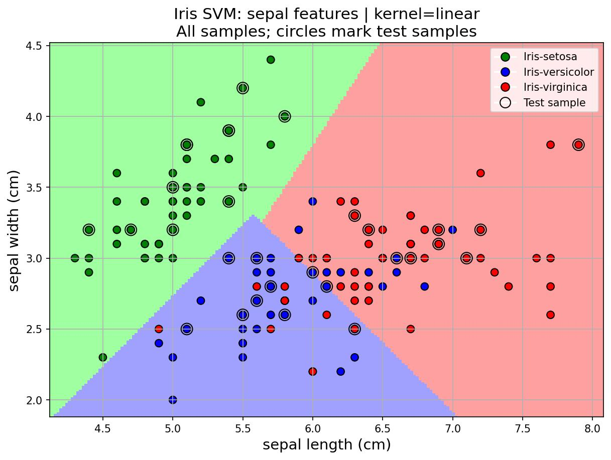
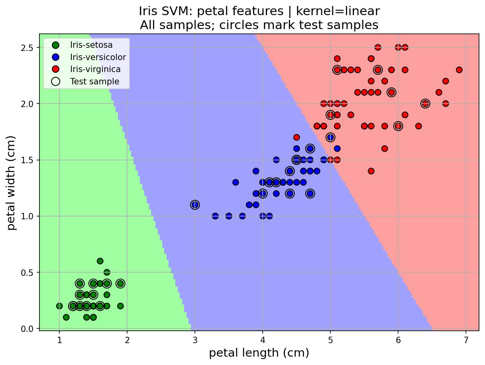
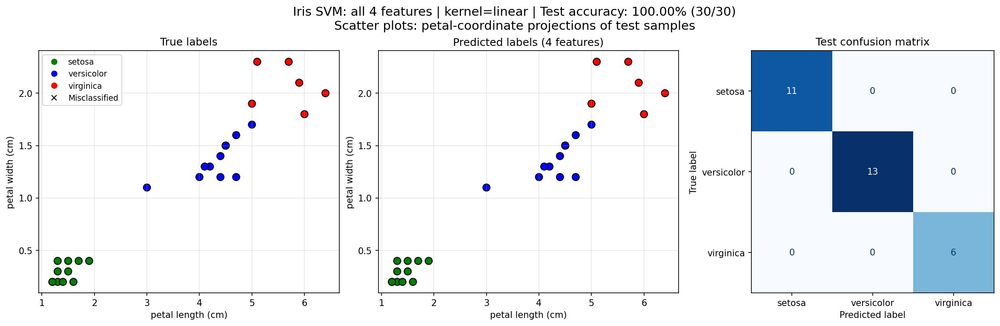
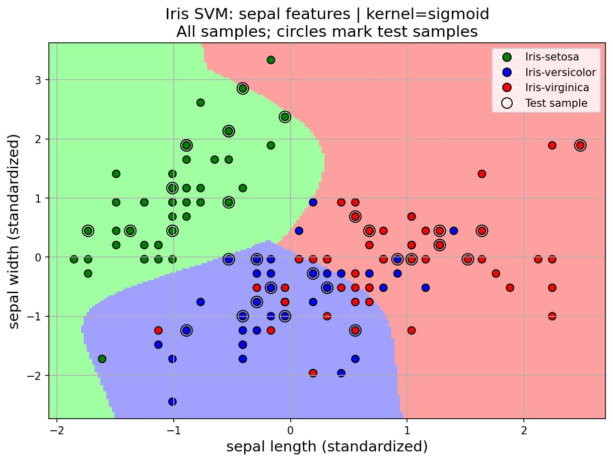
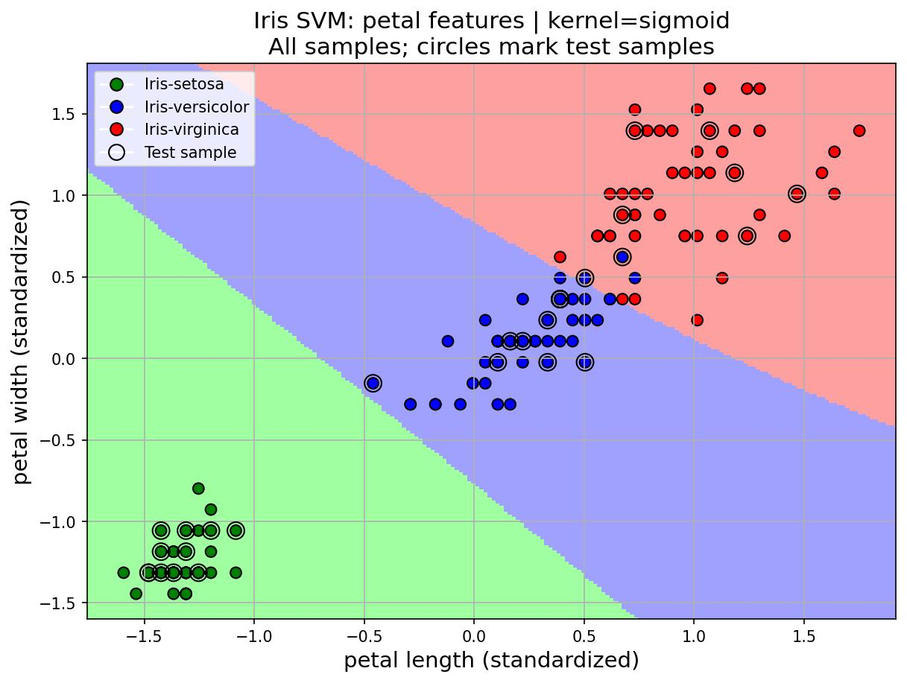
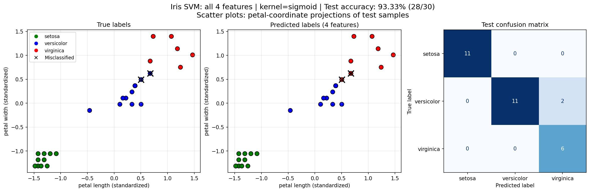

# 基于支持向量机的鸢尾花分类（SVM Sorting）

使用 scikit-learn 的 `svm.SVC` 完成鸢尾花（Iris）三分类任务，并在任务书基线之外做了三组对照实验：

1. **特征组对照**：萼片双特征 / 花瓣双特征 / 全部四特征；
2. **核函数与惩罚参数 C**：linear、poly、rbf、sigmoid 四种核，并在候选 C 集合上搜索；
3. **sigmoid 低分诊断**：分析原始特征下 sigmoid 核值饱和问题，并用只在训练集上拟合的 `StandardScaler` 做标准化对照。

数据划分固定为 `random_state=1, test_size=0.2`（120 训练 / 30 测试），三组特征共用同一划分，保证样本对应关系一致。

## 环境依赖

| 组件 | 本项目使用的版本 |
|---|---|
| Python | 3.8.10 |
| NumPy | 1.24.4 |
| scikit-learn | 1.3.2 |
| Matplotlib | 3.7.5 |

```bash
python -m venv .venv
.venv/bin/pip install numpy==1.24.4 scikit-learn==1.3.2 matplotlib==3.7.5
```

## 数据准备

程序从 `dataset/iris.data` 读取数据：150 行、逗号分隔、无表头，前四列为特征（萼片长度、萼片宽度、花瓣长度、花瓣宽度，单位 cm），第五列为类别名（`Iris-setosa` / `Iris-versicolor` / `Iris-virginica`，各 50 条）。

该数据目录不在版本控制范围内，运行前请自行放置 `dataset/iris.data`。路径由 `src/data.py` 依据源码位置推导，因此命令需在项目根目录执行。

## 目录结构

```
SVM_sorting/
├── src/
│   ├── data.py       # 数据读取、标签编码、划分与标准化
│   ├── train.py      # SVC 构建、训练与准确率计算
│   ├── plot_img.py   # 决策区域、四特征投影与混淆矩阵绘图
│   └── main.py       # 实验入口：三组特征 + C 搜索
└── pics/             # 实验结果图，按核函数分目录
    ├── linear/
    ├── poly/
    ├── rbf/
    └── sigmoid/      # 标准化 sigmoid 结果
```

## 快速开始

```bash
# 无图形环境（服务器 / SSH）：使用 Agg 后端，只保存图片
MPLBACKEND=Agg .venv/bin/python -B src/main.py

# 有图形环境：运行结束后弹出交互窗口，关闭窗口继续下一组实验
.venv/bin/python src/main.py
```

`src/main.py` 末尾的活动配置：

- 第 84 行 `kernel = 'poly'`：在这里切换核函数（`linear`、`poly`、`rbf`、`sigmoid`）；选 `sigmoid` 时会自动改用标准化后的数据加载函数；
- 第 103–105 行依次运行花瓣、萼片、四特征三组实验，固定 `C=0.8`；
- 第 88–91 行（三组固定参数实验）与第 93–101 行（C 搜索）目前被三引号包裹，属于字符串、不会执行，需要时取消注释即可；第 92 行的候选 `c_list` 定义一直处于活动状态。

运行会重新生成 `pics/<kernel>/` 下的同名图片并**覆盖**已有文件。

### 不改入口，显式运行指定核或 C 搜索

```bash
# 指定核函数绘图
MPLBACKEND=Agg .venv/bin/python -B - <<'PY'
import sys
sys.path.insert(0, 'src')
import main
main.run_sepal('sigmoid')
main.run_petal('sigmoid')
main.run_all_features('sigmoid')
PY

# 遍历候选 C，输出每组特征的最高测试准确率及其 C
.venv/bin/python -B - <<'PY'
import sys
sys.path.insert(0, 'src')
import numpy as np
import main
cs = np.linspace(0.001, 30, 300).tolist()
for kernel in ('linear', 'poly', 'rbf', 'sigmoid'):
    print('\nKernel:', kernel)
    main.run_sepal_change_c(cs, kernel)
    main.run_petal_change_c(cs, kernel)
    main.run_all_features_change_c(cs, kernel)
PY
```

## 代码结构

| 文件 | 主要函数 | 职责 |
|---|---|---|
| `src/data.py` | `iris_type()`、`_load_features()` | 读取 `iris.data`，把类别名编码为 0/1/2，按固定种子划分数据集 |
| | `iris_load_data()` / `iris_load_petal_data()` / `iris_load_all_data()` | 分别取萼片（`slice(0,2)`）、花瓣（`slice(2,4)`）、全部四特征（`slice(0,4)`） |
| | `*_sigmoid()`、`_load_feature_sigmoid()` | 复用同一划分，用训练集拟合 `StandardScaler` 后变换测试集与全体绘图样本 |
| `src/train.py` | `classifier()` / `classifier_change_c()` | 构建 `svm.SVC(C=0.8, kernel=..., decision_function_shape='ovr')`，后者可指定 C |
| | `train()`、`print_accuracy()`、`show_accuracy()` | 训练并打印训练/测试准确率（`clf.score()` 与 `predict()` 显式计算两种口径） |
| | `train_and_evaluate()` 等 | 单组特征「训练 → 评估」的封装，C 搜索版本额外返回测试准确率 |
| `src/plot_img.py` | `draw()`、`draw_petal()`、`_draw_2d()` | 在 200×200 网格上预测类别，绘制二维决策区域，黑色圆圈标出测试样本 |
| | `draw_all_features()` | 四特征模型无法直接画二维边界，改为花瓣坐标投影 + 混淆矩阵 |
| | `_save_and_show()` | 先保存到 `pics/<kernel>/` 再显示，避免交互后端阻塞保存 |
| `src/main.py` | `run_sepal()` / `run_petal()` / `run_all_features()` | 组合加载器、训练与绘图，完成一组完整实验 |
| | `_find_best_c()`、`run_*_change_c()` | 遍历候选 C，返回测试准确率最高的 C（并列时保留较早的较小 C） |

数据流：读取数据并编码标签 → 选取特征 → 固定划分 → （sigmoid 时标准化）→ 构建并训练 SVC → 计算训练/测试准确率 → 绘图或遍历候选 C。

## 实验设置

- 固定参数：`C=0.8`、`decision_function_shape='ovr'`；其余沿用 SVC 默认值（`gamma='scale'`、`degree=3`、`coef0=0`）。
- 标准化：`StandardScaler` 的均值和标准差**只由训练集计算**，测试集与绘图样本沿用同一组参数，避免数据泄漏。
- C 搜索：`np.linspace(0.001, 30, 300)`，即 300 个等间距候选值，步长约 0.100331。
- 准确率 = 预测正确样本数 / 参与评价样本数；测试集 30 个样本，每对/错一个约影响 3.33 个百分点。

SVM 部分的要点（线性核）：决策函数 $f(x)=w^\top x+b$，最大间隔为 $2/\|w\|$；软间隔目标为

$$
\min_{w,b}\ \frac12\|w\|^2 + C\sum_{i=1}^{N}\max\{0,\,1-y_i f(x_i)\},
$$

即「宽间隔」与「合页损失」之间的权衡，C 越大越偏向减少训练集的间隔违反。核技巧用 $K(x,u)=\phi(x)^\top\phi(u)$ 隐式完成特征映射：

| 核 | 公式 | 相关参数 |
|---|---|---|
| linear | $K(x,u)=x^\top u$ | C |
| poly | $K(x,u)=(\gamma x^\top u+r)^d$ | C、gamma、degree、coef0 |
| rbf | $K(x,u)=\exp(-\gamma\|x-u\|^2)$ | C、gamma |
| sigmoid | $K(x,u)=\tanh(\gamma x^\top u+r)$ | C、gamma、coef0 |

三分类由 SVC 内部的 one-vs-one 完成（训练 0-1、0-2、1-2 三个二分类器）；`decision_function_shape='ovr'` 只改变决策分数的输出形式，其输出应理解为类别决策分数，不是到分割平面的几何距离，也不是概率。

## 实验结果

### 1. 线性核基线（原始特征，C=0.8）

| 特征组 | 训练正确数/120 | 训练准确率 | 测试正确数/30 | 测试准确率 |
|---|---:|---:|---:|---:|
| 萼片 | 97 | 80.83% | 23 | 76.67% |
| 花瓣 | 117 | 97.50% | 29 | 96.67% |
| 全部四特征 | 118 | 98.33% | 30 | 100.00% |





图中背景颜色表示网格点的预测类别，散点颜色表示真实类别（绿 setosa、蓝 versicolor、红 virginica），黑色圆圈标出测试样本；四特征图给出测试集的真实标签、预测标签与混淆矩阵。相比萼片，花瓣特征在当前划分下区分度明显更强。

### 2. 候选 C 搜索（原始特征）

下表为在给定候选集合、固定其他参数下的搜索结果；`best_c` 指**首次**取得最高测试准确率的 C。

| 核 | 萼片 best_c | 萼片最高准确率 | 花瓣 best_c | 花瓣最高准确率 | 四特征 best_c | 四特征最高准确率 |
|---|---:|---:|---:|---:|---:|---:|
| linear | 0.301993 | 83.33% | 0.101331 | 96.67% | 0.502656 | 100.00% |
| poly | 0.101331 | 83.33% | 0.101331 | 96.67% | 0.101331 | 100.00% |
| rbf | 0.402324 | 83.33% | 0.101331 | 96.67% | 3.512589 | 100.00% |
| sigmoid | 0.001 | 20.00% | 0.001 | 20.00% | 0.001 | 20.00% |

准确率常出现较长的平台：例如花瓣组在 linear、poly、rbf 下，约 0.101331 至 30 的全部 299 个候选点都是 96.67%。因此三个核返回相同的 `best_c` 只说明它们**恰好先后触及各自首个最高分**，不能推出存在唯一最优参数。

### 3. sigmoid 核值饱和与标准化对照

sigmoid 核为 $\tanh(\gamma x^\top u+\mathrm{coef0})$。原始特征全为正数、配合默认参数时，训练样本两两之间的核值大量落入 tanh 的正向饱和区（萼片组核值全部大于 0.9999，四特征组约 86% 大于 0.99），不同输入的核值差异被压缩，模型在 C=0.8 时几乎把所有样本判为同一类，训练准确率仅 36.67%/14.17%。

固定 C=0.8，对 sigmoid 做标准化前后对照：

| 特征组 | 原始训练准确率 | 原始测试准确率 | 标准化训练准确率 | 标准化测试准确率 |
|---|---:|---:|---:|---:|
| 萼片 | 36.67% | 20.00% | 77.50% | 83.33% |
| 花瓣 | 14.17% | 6.67% | 98.33% | 93.33% |
| 全部四特征 | 36.67% | 20.00% | 91.67% | 93.33% |

标准化后的 C 搜索：萼片 0.402324 → 83.33%，花瓣 1.104642 → 96.67%，四特征 0.301993 → 93.33%。由于 `gamma='scale'` 会依据标准化后的训练输入重新计算，改善应归因于「标准化 + gamma 自适应」这一整体处理。





标准化后坐标轴单位为「相对训练集均值的标准差」，因此图轴标注为 standardized 而非 cm。

### 4. 其他核的图像（固定 C=0.8）

| 核 | 萼片图 | 花瓣图 | 四特征图 |
|---|---|---|---|
| poly | [二维分类图](pics/poly/SVM_sorting.jpg) | [二维分类图](pics/poly/SVM_petal.jpg) | [投影及混淆矩阵](pics/poly/SVM_all_features.jpg) |
| rbf | [二维分类图](pics/rbf/SVM_sorting.jpg) | [二维分类图](pics/rbf/SVM_petal.jpg) | [投影及混淆矩阵](pics/rbf/SVM_all_features.jpg) |

这些图对应固定 C=0.8，不对应第 2 节表格中的搜索最佳 C（poly、rbf 的四特征图均为 29/30，即 96.67%）。

## 结论与局限

**结论**

1. 相同划分、相同 C=0.8 下，花瓣与四特征输入明显优于萼片，说明输入特征对分类效果有实质影响；
2. C 的合适取值依赖特征组、核函数及其他核参数，返回的 `best_c` 是候选集合中并列最高结果里最小的一个，不是解析最优点；
3. 原始特征下 sigmoid 核值饱和导致严重学习不足，标准化后准确率大幅回升；但现有各核的预处理条件并不完全一致，不足以给出四种核的普遍优劣排名。

**局限**

- `_find_best_c()` 使用**测试集准确率**选择 C，测试集已参与模型选择，搜索最高分偏乐观；
- 测试集仅 30 个样本，且只做了一次非分层（未设置 `stratify`）随机划分，训练/测试类别数并不完全相等（39/37/44 与 11/13/6），未报告跨划分波动或置信区间；
- 四特征的 100% 只代表这 30 个样本全对，不等于总体错误率为零；
- C 网格为等间距且在小 C 区域较粗，未联合搜索 gamma、degree、coef0。

后续可考虑：保留独立测试集，在训练集内部做分层交叉验证并联合选择超参数；将 `StandardScaler` 放入 `Pipeline` 以免折间泄漏；在对数尺度搜索 C；记录并列最优范围与各类别指标。
